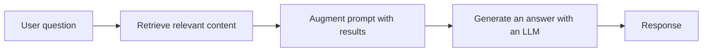
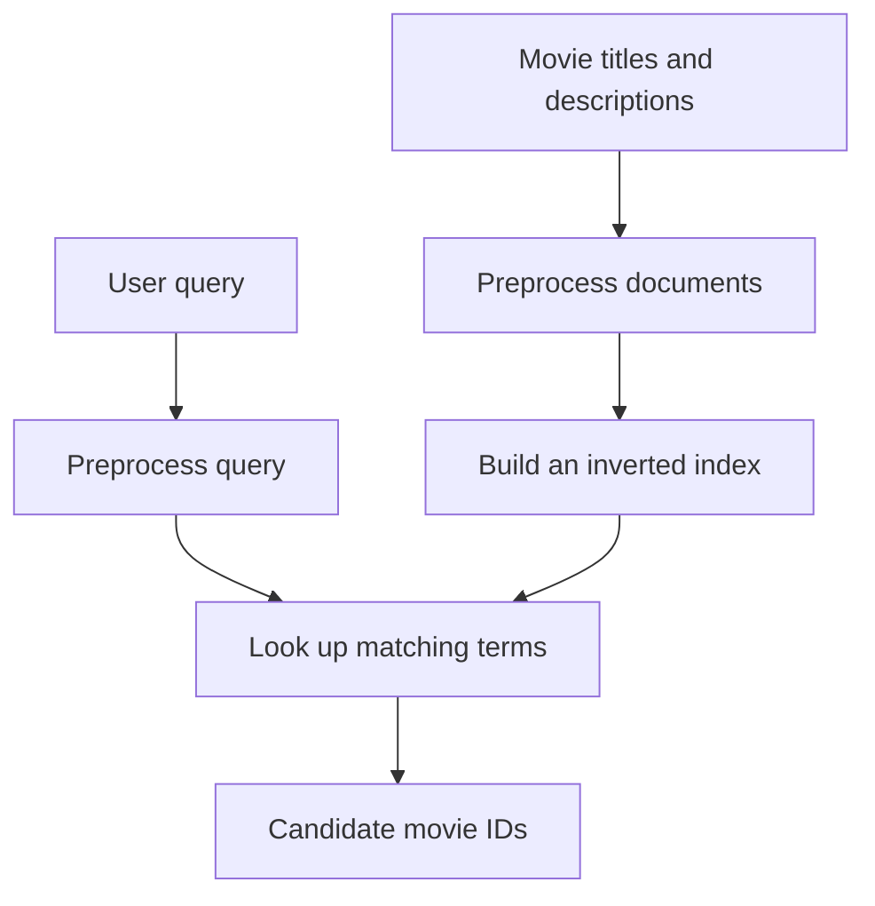
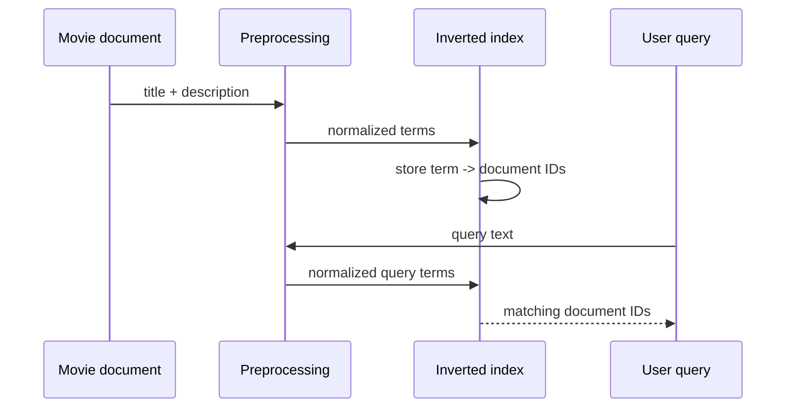

# Chapter 1: Preprocessing

> Status: Complete draft based on the supplied course material
>
> Course scope: Retrieval Augmented Generation, search, project setup, keyword search, punctuation, tokenization, stop words, and stemming

Preprocessing is the first transformation applied to search data. It turns inconsistent human text into a representation that a retrieval algorithm can compare efficiently.

In this project, preprocessing is deliberately simple and deterministic:

```text
raw text -> case folding -> punctuation removal -> tokenization
		  -> stopword removal -> Porter stemming -> searchable terms
```

The same conceptual pipeline must be applied to both indexed documents and user queries. Otherwise, a query and a document can contain the same idea while producing different terms in the index.

## 1. Retrieval Augmented Generation

Retrieval Augmented Generation, usually shortened to **RAG**, combines search with language generation. A RAG system does not ask an LLM to answer from its parameters alone. It first retrieves relevant information, adds that information to the model's instructions, and then generates an answer using the augmented context.

The three letters describe the broad workflow:

- **Retrieval:** find relevant information with a search algorithm.
- **Augmentation:** add the retrieved information to the model's context or instructions.
- **Generation:** use an LLM to produce a useful response grounded in that context.



This chapter focuses on the first part: preparing text so retrieval can work. It does not yet implement embeddings, prompt construction, LLM calls, citations, or answer generation.

### Why preprocessing belongs in RAG

Search quality depends on the representation being searched. Before the system can decide whether two terms match, it needs a policy for questions such as:

- Should `Bear` and `bear` match?
- Should punctuation change a term?
- Is `running` related to `run`?
- Should common words such as `the` influence retrieval?
- Should a query use the same transformations as indexed documents?

There is no universally correct preprocessing pipeline. Each transformation trades recall, precision, simplicity, and information preservation. The right choice depends on the data and the search task.

## 2. What Is Search?

Search is the process of finding useful items in a collection in response to a user request. In a movie catalog, a user should not need to inspect every movie manually. The system should identify a small set of relevant candidates.

Modern search often aims for more than exact string equality:

- Match useful results when capitalization or punctuation differs.
- Match related word forms such as `running` and `run`.
- Match semantic meaning when different words express the same idea.
- Interpret intent and context.
- Present concise results instead of exposing the entire source dataset.

This project begins with **lexical keyword search**. Lexical search compares terms or tokens. It is fast, understandable, and valuable when exact terminology matters, but it does not automatically understand synonyms or meaning. Semantic search and generation are later stages in the course roadmap.



## 3. Project Overview

The project implements a small command-line search engine over `data/movies.json`. The main implementation surfaces are:

- [text_processing.py](../cli/lib/text_processing.py): text normalization and term preparation.
- [inverted_index.py](../cli/lib/inverted_index.py): document indexing, postings, and term frequencies.
- [keyword_search_cli.py](../cli/keyword_search_cli.py): command-line workflows.
- `data/stopwords.txt`: the stopword vocabulary used by the current pipeline.
- `cache/`: generated serialized index data.

The current index combines each movie's title and description into one text field before processing it. It stores a mapping from a normalized term to the document IDs containing that term. It also stores the original movie records so IDs can be displayed as titles later.

Build the local cache from the repository root:

```bash
uv run cli/keyword_search_cli.py build
```

Then run a keyword query:

```bash
uv run cli/keyword_search_cli.py search "running"
```

The repository's implementation expects commands to run from the project root because the data and stopword paths are relative paths.

### Course project versus this repository

The course begins with a simple `main.py`, then progressively builds a `cli` implementation. This repository has already completed those exercises and now uses a persisted inverted index. The course's Boot.dev submission commands verify the learner's environment; they are not part of the runtime search engine itself.

## 4. Keyword Search

Keyword search checks whether query terms occur in the indexed collection. A basic implementation can scan every movie and check whether the query is a substring of its title. That approach is easy to understand but becomes inefficient as the dataset grows.

An **inverted index** changes the lookup direction:

```text
term -> documents containing the term
```

For example:

```python
{
	"bear": {12, 44, 91},
	"matrix": {7, 53},
}
```

The value is called a **postings list** or postings set. A query can use the term as a key and jump directly to candidate documents instead of scanning every record.

The current search command preprocesses the query, looks up each normalized term, and appends matching IDs while it attempts to stop at five results. Because it extends a complete postings list before checking the length, one term can make the result list larger than five. It is a teaching implementation, not yet a complete ranked retrieval system:

- Results are not ranked by TF-IDF.
- Multiple query terms can produce duplicate document IDs.
- Query terms are combined by collecting postings rather than a carefully defined Boolean AND/OR policy.
- The title and description are indexed as one combined field.

These limitations are useful learning checkpoints. A later keyword-search chapter can improve matching and ranking without changing the purpose of preprocessing.

## 5. Text Processing

Text processing makes equivalent inputs more comparable. The current implementation uses the following sequence for indexed documents and multi-token queries:

1. **Case folding:** convert text to a lowercase-like canonical form.
2. **Punctuation removal:** delete characters listed in `string.punctuation`.
3. **Tokenization:** split the text on whitespace.
4. **Stopword removal:** discard tokens found in `data/stopwords.txt`.
5. **Stemming:** reduce tokens with NLTK's `PorterStemmer`.


The first four functions are intentionally small and composable:

```python
from lib.text_processing import (
	normalize_text,
	remove_stopwords,
	stem_words,
	tokenize_text,
)

text = normalize_text("The Running Bear!")
tokens = tokenize_text(text)
tokens = remove_stopwords(tokens)
terms = stem_words(tokens)
print(terms)
```

The output depends on the stopword file, but the important result is that both the document and query use the same sequence. This is a **deterministic** pipeline: the same input and same configuration should produce the same terms.

### Normalization is a policy

Every transformation can remove information. Removing punctuation may make `sci-fi` become `scifi`. Stemming may map words to a form that is not a normal dictionary word. Removing stopwords may harm searches where a small word is meaningful, such as a title that intentionally includes `The`.

Good preprocessing is therefore not “as much cleanup as possible.” It is a deliberate representation choice supported by examples and evaluation.

## 6. Punctuation

The `normalize_text` helper uses `str.maketrans` and `string.punctuation`:

```python
import string

exclusion_table = str.maketrans("", "", string.punctuation)
normalized = text.casefold().translate(exclusion_table)
```

Examples:

```text
"Boots the bear!"       -> "boots the bear"
"Magic, Charlie Brown"  -> "magic charlie brown"
"sci-fi"                -> "scifi"
```

Removing punctuation supports simple matching across punctuation differences. It also has consequences:

- Hyphenated words can be merged rather than separated.
- Apostrophes are discarded, so contractions change shape.
- Punctuation that carries meaning in identifiers, dates, or code is lost.
- `string.punctuation` is an ASCII punctuation set, not a complete Unicode punctuation policy.

For this movie-search dataset, the simple rule is acceptable as a first exercise. Production systems should choose whether to remove, replace, or preserve each punctuation class based on the domain.

## 7. Tokenization

Tokenization divides text into units that can be indexed. This project uses Python's whitespace-aware `split()`:

```python
def tokenize_text(value: str) -> list[str]:
	return value.split()
```

For example:

```text
"the matrix is a great movie"
-> ["the", "matrix", "is", "a", "great", "movie"]
```

Calling `split()` without an argument treats runs of whitespace as separators and avoids empty tokens. These tokens are ordinary words for this search engine. They are different from LLM tokens, which are usually subword units created by a tokenizer such as byte-pair encoding.

The course's matching exercise changes the query from one exact full-title substring into token-level matching. That enables a query such as `Great Bear` to match a title containing `Bear`, because at least one processed query token can be found in the title's processed tokens.

Tokenization choices affect the vocabulary and therefore every later retrieval stage. Alternatives include character n-grams, word n-grams, language-specific tokenizers, subword tokenizers, and structure-aware tokenizers.

## 8. Stop Words

Stop words are common words that often contribute little topical information, such as `the`, `of`, `is`, and `in`. If they remain in an index, a query such as `the bear` can retrieve many documents merely because they contain `the`.

The current helper loads the stopword file and filters exact token matches:

```python
with open("data/stopwords.txt", "r") as f:
	stopwords = set(f.read().splitlines())

filtered = [token for token in tokens if token not in stopwords]
```

The set is used for membership checks. The stopword vocabulary must be compatible with the rest of the pipeline. In particular, stopwords should be normalized consistently before comparison. The current repository file contains already-normalized entries suitable for the current lowercase-and-punctuation-removal behavior.

Stopword removal is not always beneficial. It can remove meaningful words from names, titles, legal text, or short queries. Modern ranking systems often keep stopwords and let the scoring model assign them low importance. Removing them is a trade-off, not a universal rule.

## 9. Stemming

Stemming reduces related word forms to a shared approximate base. This project uses NLTK's Porter algorithm:

```python
from nltk.stem import PorterStemmer

stemmer = PorterStemmer()
stems = [stemmer.stem(token) for token in tokens]
```

Typical examples include:

```text
running, runs, ran -> approximate shared stems
jumping, jumped    -> approximate shared stem
watching, watches  -> approximate shared stem
```

A stem is not necessarily a valid dictionary word. Stemming is a heuristic designed to improve matching, not a full linguistic analysis. It can improve recall by connecting word variants, but it can also create collisions between words that should remain distinct.

Lemmatization is a related alternative that attempts to return a dictionary form using morphology and often part-of-speech information. It may be more linguistically precise but requires more language resources and assumptions.

## End-to-End Implementation

The index applies the pipeline while building postings:

```python
tokens = stem_words(
	remove_stopwords(
		tokenize_text(normalize_text(text))
	)
)
```

The query path applies the same operations. For single-term commands such as `tf`, `idf`, and `tfidf`, `tokenize_and_normalize` additionally requires that the input become exactly one term after preprocessing.



## Dos and Don'ts

### Do

- Apply the same preprocessing configuration to documents and queries.
- Keep the order of transformations explicit and reproducible.
- Test transformations with representative examples from the actual domain.
- Preserve the raw document text so results can be displayed and audited.
- Evaluate preprocessing choices using retrieval quality, not only intuition.
- Document language, punctuation, stopword, and stemming assumptions.

### Don't

- Treat preprocessing as a universal cleanup recipe.
- Remove information before checking whether the domain needs it.
- Process indexed documents and queries with different rules.
- Assume stemming understands meaning or produces valid words.
- Confuse ordinary word tokens with LLM tokenizer tokens.
- Claim that keyword preprocessing provides semantic search or generation.

## Failure Modes and Edge Cases

- **Relative paths:** commands must run from the repository root because the stopword and dataset paths are relative.
- **Empty query after filtering:** a query containing only stopwords can produce no useful terms.
- **Multiword single-term commands:** `tf`, `idf`, and `tfidf` reject inputs that do not reduce to one term.
- **Punctuation-sensitive terms:** removing punctuation can merge or erase meaningful distinctions.
- **Unicode text:** `casefold()` is broader than `lower()`, but `string.punctuation` still represents an ASCII punctuation policy.
- **Stemming collisions:** different words can map to the same stem and create false matches.
- **Stopword drift:** changing `data/stopwords.txt` changes the index vocabulary and requires rebuilding the cache.
- **Cache drift:** changing preprocessing code also requires rebuilding `cache/index.pkl`, `cache/docmap.pkl`, and `cache/term_frequencies.pkl`.

## Verification

Build the index and run representative queries from the repository root:

```bash
uv run cli/keyword_search_cli.py build
uv run cli/keyword_search_cli.py search "running"
uv run cli/keyword_search_cli.py search "magic charlie"
uv run cli/keyword_search_cli.py tf 1 police
uv run cli/keyword_search_cli.py idf police
uv run cli/keyword_search_cli.py tfidf 1 police
```

The Boot.dev lesson checks can be run with the course-provided `bootdev run` and `bootdev run -s` commands. Those commands validate the learner's submission environment and should be kept separate from application-level tests.

## References

- [Retrieval-augmented generation](https://en.wikipedia.org/wiki/Retrieval-augmented_generation)
- [Search engine indexing and tokenization](https://en.wikipedia.org/wiki/Search_engine_indexing)
- [Stop word](https://en.wikipedia.org/wiki/Stop_word)
- [Word stemming](https://en.wikipedia.org/wiki/Stemming)
- [Python `str.casefold`](https://docs.python.org/3/library/stdtypes.html#str.casefold)
- [Python `str.translate` and `str.maketrans`](https://docs.python.org/3/library/stdtypes.html#str.translate)
- [Python `string.punctuation`](https://docs.python.org/3/library/string.html#string.punctuation)
- [Python `str.split`](https://docs.python.org/3/library/stdtypes.html#str.split)
- [NLTK stemming documentation](https://www.nltk.org/api/nltk.stem.html)
- [NLTK `PorterStemmer`](https://www.nltk.org/api/nltk.stem.porter.html)

## Further Reading

- Manning, Raghavan, and Schutze, [*Introduction to Information Retrieval*](https://nlp.stanford.edu/IR-book/), especially the chapters on inverted indexes and term vocabulary.
- Lewis et al., [*Retrieval-Augmented Generation for Knowledge-Intensive NLP Tasks*](https://arxiv.org/abs/2005.11401).
- [Unicode Standard Annex #15: Unicode Normalization Forms](https://unicode.org/reports/tr15/), for a deeper look at normalization beyond this project's simple pipeline.

[Back to the documentation index](README.md)
