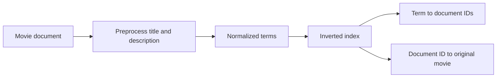
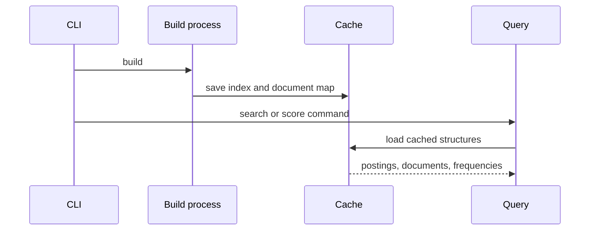
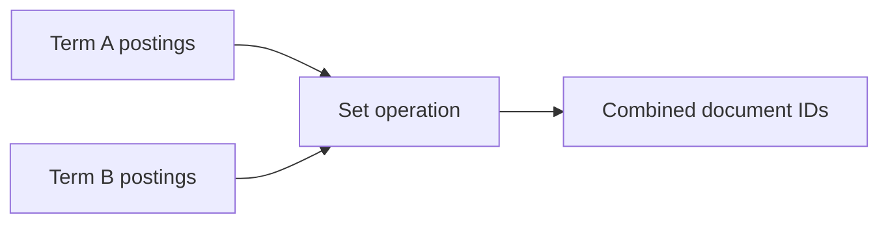
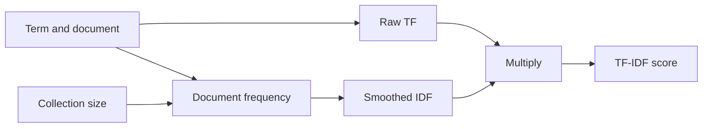

# Chapter 2: TF-IDF

> Status: Complete draft based on the supplied course material
>
> Course scope: inverted indexes, cached lookup, Boolean set operations, term frequency, inverse document frequency, and TF-IDF

TF-IDF is a classic lexical retrieval signal. It gives a term a high score when the term appears often in one document but does not appear in many documents across the collection.

The two components answer different questions:

- **TF:** How often does this term occur in this document?
- **IDF:** How unusual is this term in the whole collection?

The combined score is:

$$
\operatorname{tfidf}(t, d) = \operatorname{tf}(t, d) \times \operatorname{idf}(t)
$$

This chapter follows the course implementation from an inverted index through individual TF, IDF, and TF-IDF CLI queries. The current project exposes these values for inspection; its `search` command does not yet rank results by TF-IDF.

## 1. Inverted Index

An inverted index is a lookup structure for text. A forward representation maps a document to its contents:

```text
document ID -> document text
```

An inverted representation reverses that relationship:

```text
term -> documents containing the term
```

For example:

```text
matrix  -> {1, 5, 10}
hacker  -> {1, 8}
reality -> {1, 3, 7}
```

The document IDs are stored as sets because membership is the important operation and a document should appear only once for a term, no matter how many times that term occurs. Repeated occurrences are tracked separately for TF.



### Build cost and lookup cost

Building the index still requires reading and preprocessing every document. If there are $N$ documents and $L$ total processed tokens, the build work is proportional to the input size, approximately $O(L)$ for this simple pipeline.

After construction, a dictionary lookup for a term is $O(1)$ on average. Returning or sorting its postings still costs time proportional to the number of matching documents. The index moves repeated work from every query into one build step.

### Repository implementation

The project's [InvertedIndex](../cli/lib/inverted_index.py) maintains:

- `index`: normalized term to a set of document IDs.
- `docmap`: document ID to the original movie dictionary.
- `term_frequencies`: normalized term to document ID to raw count.

The index exposes `get_documents(term)` to return sorted document IDs for a preprocessed term.

During `build()`, the title and description are concatenated, preprocessed, and added to the index. The original movie object is saved in `docmap` so a result ID can later be rendered as a title.

## 2. Use the Index

The index is persisted with Python's `pickle` module. The build workflow creates:

```text
cache/index.pkl
cache/docmap.pkl
cache/term_frequencies.pkl
```

Build the cache from the repository root:

```bash
uv run cli/keyword_search_cli.py build
```

Then load it for search or score inspection. A cache avoids rebuilding the index before every query, provided that the source data and preprocessing configuration have not changed.



### Cache invalidation

The cache is derived data, not the source of truth. Rebuild it whenever any of these change:

- `data/movies.json`
- `data/stopwords.txt`
- normalization or tokenization code
- stemming configuration or library version

Loading a stale cache can produce plausible but incorrect search and score results. In a production system, the cache would usually carry a version, source fingerprint, or build metadata so stale artifacts can be detected automatically.

### Pickle caution

Pickle is convenient for a local learning project, but unpickling data from an untrusted source can execute arbitrary code. Only load cache files generated by a trusted build process. A production service may use a database, a search engine, a safe serialization format, or a managed index instead.

## 3. Boolean Search

An inverted index stores sets, so common Boolean operations become set operations:

- **AND:** intersection. Keep IDs present in both sets.
- **OR:** union. Keep IDs present in either set.
- **NOT:** difference. Remove IDs in the second set from the first set.



For example:

```python
bear = {1, 3, 5, 7, 9}
forest = {1, 4, 5, 8}
terror = {7, 9}

both = bear & forest
either = bear | forest
without_terror = bear - terror
```

The results are:

```text
bear AND forest -> {1, 5}
bear OR forest  -> {1, 3, 4, 5, 7, 8, 9}
bear NOT terror -> {1, 3, 5}
```

The current CLI does not parse explicit `AND`, `OR`, or `NOT` syntax. Its multi-token search collects postings for query terms in sequence. Boolean operations are still an important conceptual bridge: a keyword search engine can manipulate compact ID sets without repeatedly reading full documents.

`OR` is the operation that can grow the result set because it combines candidates. `AND` can only preserve or reduce the size of the first set, and `NOT` can only remove elements from it.

## 4. Term Frequency

Term frequency, written as $\operatorname{tf}(t,d)$, counts the occurrences of term $t$ in document $d$.

For this text:

```text
Students learn debugging. The students practice, and students improve.
```

after preprocessing, `student` might have a raw count of 3. A term appearing repeatedly can be a useful signal that the document discusses that concept, but repetition is not proof of relevance. Keyword stuffing is a classic example of why raw frequency alone is insufficient.

The current implementation increments a nested count while adding each processed token:

```python
self.term_frequencies[token][doc_id] = (
	self.term_frequencies[token].get(doc_id, 0) + 1
)
```

Its lookup method returns zero when the term or document is absent:

```python
def get_tf(self, doc_id: int, term: str) -> int:
	return self.term_frequencies.get(term, {}).get(doc_id, 0)
```

The course describes using `collections.Counter` objects keyed by document ID. This repository uses ordinary nested dictionaries keyed first by term. Both representations can answer the same query; they make different access patterns convenient.

### Raw versus normalized TF

The project uses **raw TF**:

$$
\operatorname{tf}(t,d) = \text{count of }t\text{ in }d
$$

Other choices include:

- Binary TF: $1$ if the term occurs, otherwise $0$.
- Log-scaled TF: $1 + \log(\operatorname{tf})$ for nonzero counts.
- Length-normalized TF: divide by the number of terms in the document.

Raw TF is easy to explain and matches the course assignment. It can favor long documents, so production retrieval often uses a bounded or normalized variant.

Run the project's TF command after building the cache:

```bash
uv run cli/keyword_search_cli.py tf 424 bear
uv run cli/keyword_search_cli.py tf 424 trapper
```

The term is normalized before lookup. A multiword input is rejected because this command expects one processed term.

## 5. Inverse Document Frequency

Document frequency, $\operatorname{df}(t)$, is the number of documents containing term $t$ at least once. It is different from TF: repeated occurrences in one document do not increase document frequency.

Inverse document frequency gives more weight to terms that occur in fewer documents. The project uses the smoothed formula from the course:

$$
\operatorname{idf}(t) = \log\left(\frac{N+1}{\operatorname{df}(t)+1}\right)
$$

where:

- $N$ is the total number of indexed documents.
- $\operatorname{df}(t)$ is the number of documents in the term's postings list.
- The logarithm reduces the scale of the ratio.
- Adding $1$ prevents division by zero for unseen terms.

The smoothing has useful edge-case behavior:

- An unseen term has $\operatorname{df}=0$ and receives $\log(N+1)$.
- A term in every document has $\operatorname{df}=N$ and receives $0$.
- Common terms receive smaller scores than rare terms.

For 100 documents, the unsmoothed intuition is:

```text
term in 95 documents -> low IDF
term in 2 documents  -> high IDF
term in 100 documents -> zero IDF
```

Stopwords and IDF solve related but different problems. Stopwords are selected before indexing using a general vocabulary policy. IDF is calculated from the actual collection and can identify dataset-specific common terms such as `actor` or `movie`.

The CLI calculates document frequency from the postings returned by the index:

```python
idf_score = math.log(
	(len(inverted_index.docmap) + 1)
	/ (len(inverted_index.get_documents(tokenized_term)) + 1)
)
```

Run IDF inspection commands:

```bash
uv run cli/keyword_search_cli.py idf grizzly
uv run cli/keyword_search_cli.py idf actor
uv run cli/keyword_search_cli.py idf man
```

The exact values depend on the contents of `data/movies.json` and `data/stopwords.txt`.

## 6. TF-IDF

TF-IDF multiplies local importance by collection-wide rarity:

$$
\operatorname{tfidf}(t,d) = \operatorname{tf}(t,d) \times \operatorname{idf}(t)
$$

A term must satisfy both conditions to receive a high score:

1. It appears frequently enough in the document.
2. It is uncommon across the collection.

Consider two terms in a movie collection:

```text
cyborg: rare, high IDF
bear: common, low IDF
```

A document containing one `cyborg` can outrank a document containing several `bear` occurrences. A document containing both can score highly because it has evidence for both the specific and broad query concepts.

For a query with multiple terms, a common retrieval strategy is to sum the per-term scores:

$$
\operatorname{score}(d,q) = \sum_{t \in q} \operatorname{tfidf}(t,d)
$$

The current `tfidf` command intentionally scores one document and one normalized term at a time. It does not yet calculate a multi-term ranking over all movies.



Run the command:

```bash
uv run cli/keyword_search_cli.py tfidf 424 trapper
uv run cli/keyword_search_cli.py tfidf 424 push
```

The CLI formats the score to two decimal places. Formatting is presentation only; it does not change the underlying calculation.

## End-to-End Repository Flow

```text
data/movies.json
	-> preprocess title + description
	-> build term -> document ID postings
	-> count term -> document ID occurrences
	-> save pickle files under cache/
	-> load cache for a query
	-> normalize one query term
	-> retrieve TF and postings length
	-> calculate IDF
	-> multiply TF by IDF
```

The implementation is intentionally inspectable. It exposes the intermediate values through separate `tf`, `idf`, and `tfidf` commands before a later chapter combines retrieval strategies into a more complete ranked search system.

## What This Implementation Does Not Yet Do

- It does not rank the `search` command's results by TF-IDF.
- It does not normalize TF by document length.
- It does not use field weighting for title versus description.
- It does not calculate a multi-term score for a whole query.
- It does not parse explicit Boolean operators.
- It does not use BM25, a vector index, semantic embeddings, or a learned reranker.
- It does not attach cache version metadata.
- It uses pickle files suitable for a trusted local exercise, not an untrusted service boundary.

These are not defects relative to the course assignment. They define the boundary between this chapter's teaching implementation and later retrieval-engineering work.

## Dos and Don'ts

### Do

- Build the index once and reuse it while source data and preprocessing remain unchanged.
- Keep postings sets separate from occurrence counts.
- Use document frequency, not total token count, for IDF.
- Normalize query terms with the same pipeline used during indexing.
- Explain the smoothing formula and its edge cases.
- Evaluate ranking quality on representative queries before changing TF or IDF variants.

### Don't

- Treat a high TF as proof that a document is relevant.
- Count repeated occurrences when calculating document frequency.
- Compare scores generated from incompatible preprocessing pipelines.
- Assume raw TF-IDF is automatically a complete search ranking algorithm.
- Load pickle files from untrusted sources.
- Forget to rebuild the cache after changing data, stopwords, or preprocessing.

## Failure Modes and Edge Cases

- **Missing cache:** run the `build` command before lookup commands.
- **Stale cache:** rebuild after changing input data or preprocessing.
- **Unseen term:** smoothed IDF remains defined, but TF is zero for every known document.
- **Universal term:** a term in every document receives IDF zero and contributes no TF-IDF score.
- **Long documents:** raw TF can favor documents with more text.
- **Single-term constraint:** `tf`, `idf`, and `tfidf` reject input that does not reduce to exactly one normalized token.
- **Stemming:** the term used in the formula is the stemmed index term, not necessarily the original query spelling.
- **Non-atomic cache writes:** the current `save` method writes multiple pickle files independently; an interrupted build can leave a mixed cache.

## Verification

Build the current cache and inspect each component:

```bash
uv run cli/keyword_search_cli.py build
test -s cache/index.pkl
test -s cache/docmap.pkl
test -s cache/term_frequencies.pkl
```

Then verify the score commands:

```bash
uv run cli/keyword_search_cli.py tf 424 bear
uv run cli/keyword_search_cli.py tf 424 trapper
uv run cli/keyword_search_cli.py idf grizzly
uv run cli/keyword_search_cli.py idf actor
uv run cli/keyword_search_cli.py idf man
uv run cli/keyword_search_cli.py tfidf 424 trapper
uv run cli/keyword_search_cli.py tfidf 424 push
```

The Boot.dev lesson checks can be run with the course-provided `bootdev run` and `bootdev run -s` commands. Their expected values depend on the exact dataset and stopword file, so do not substitute a different movie dataset when comparing results.

## References

- [Inverted index](https://en.wikipedia.org/wiki/Inverted_index)
- [Database index](https://en.wikipedia.org/wiki/Database_index)
- [TF-IDF](https://en.wikipedia.org/wiki/Tf%E2%80%93idf)
- [Python `sorted`](https://docs.python.org/3/library/functions.html#sorted)
- [Python `collections.Counter`](https://docs.python.org/3/library/collections.html#collections.Counter)
- [Python `pickle.dump`](https://docs.python.org/3/library/pickle.html#pickle.dump)
- [Python `pickle.load`](https://docs.python.org/3/library/pickle.html#pickle.load)

## Further Reading

- Manning, Raghavan, and Schutze, [*Introduction to Information Retrieval*](https://nlp.stanford.edu/IR-book/), especially the chapters on indexes and scoring.
- Robertson and Zaragoza, [*The Probabilistic Relevance Framework: BM25 and Beyond*](https://www.staff.city.ac.uk/~sbrp622/papers/foundations_bm25_review.pdf), for the motivation behind BM25 as a practical successor to raw TF-IDF in many lexical systems.
- [Scikit-learn's TF-IDF documentation](https://scikit-learn.org/stable/modules/feature_extraction.html#text-feature-extraction), for a contrasting library implementation with configurable normalization and weighting.

[Back to the documentation index](README.md)
