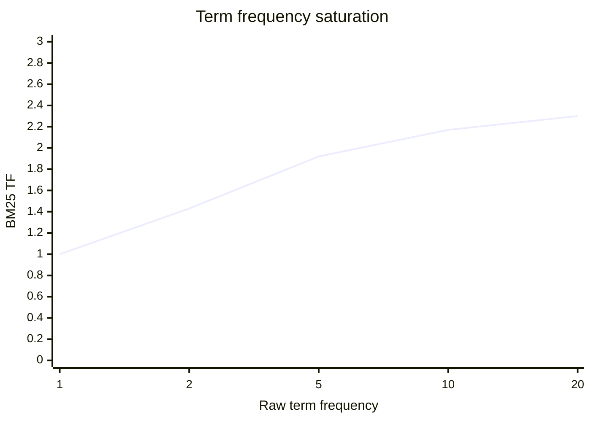
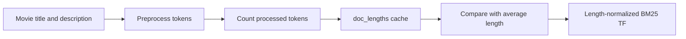
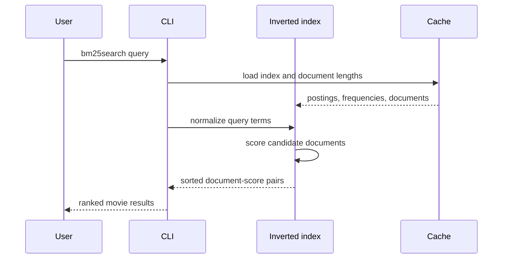

# Chapter 3: Keyword Search

> Status: Complete draft based on the supplied course material
>
> Course scope: BM25 scoring, term-frequency saturation, document-length normalization, and ranked keyword search

Keyword search is lexical retrieval: it finds documents whose processed terms match terms in a query. This makes it fast, explainable, and effective when the vocabulary matters. It does not understand synonyms or meaning by itself; that boundary leads into the next chapter on semantic search.

The course begins with an inverted index and then improves ranking with BM25. The current repository implements all four stages in [inverted_index.py](../cli/lib/inverted_index.py) and exposes them through [keyword_search_cli.py](../cli/keyword_search_cli.py).

## 1. BM25

TF-IDF is a useful starting point, but Okapi BM25 improves lexical ranking in three important ways:

1. A more stable inverse-document-frequency calculation.
2. Term-frequency saturation, so repeated occurrences have diminishing returns.
3. Document-length normalization, so long documents do not win merely because they contain more words.

For a term $t$ and document $d$, BM25 combines a term-frequency component and an IDF component:

$$
\operatorname{BM25}(t,d) = \operatorname{TF}_{BM25}(t,d) \times \operatorname{IDF}_{BM25}(t)
$$

### BM25 IDF

Let $N$ be the number of indexed documents and $df(t)$ be the number of documents containing the term. This project uses:

$$
\operatorname{IDF}_{BM25}(t) = \ln\left(1 + \frac{N - df(t) + 0.5}{df(t) + 0.5}
\right)
$$

The `0.5` values smooth the ratio, while the final `+ 1` keeps the result positive. In contrast, the earlier TF-IDF formula can reach zero for a term appearing in every document and needs separate smoothing for unseen terms.

```python
n = len(self.docmap)
df = len(self.get_documents(term))
return math.log((n - df + 0.5) / (df + 0.5) + 1)
```

The `bm25idf` command normalizes a user term before calculating this value:

```bash
uv run cli/keyword_search_cli.py bm25idf grizzly
uv run cli/keyword_search_cli.py bm25idf actor
uv run cli/keyword_search_cli.py bm25idf love
```

### Smoothing and interpretation

BM25 scores are relative to the indexed collection. A rare term generally receives a larger IDF than a common term, but a score is not a probability or a universal measure of relevance. Changing the dataset changes document frequencies and therefore changes every IDF value.

## 2. Term Frequency Saturation

Raw TF grows linearly: a term appearing 100 times receives ten times the raw count of a term appearing 10 times. That can reward repetition or keyword stuffing. BM25 replaces raw TF with a bounded, saturating component:

$$
\operatorname{TF}_{BM25}(t,d) = \frac{f(t,d)(k_1+1)}{f(t,d)+k_1}
$$

where $f(t,d)$ is the raw count and $k_1$ controls how quickly the score saturates. The repository default is `BM25_K1 = 1.5`.

```python
raw_tf = self.get_tf(doc_id, term)
return (raw_tf * (k1 + 1)) / (raw_tf + k1)
```

The first occurrence has a large effect. Later occurrences still help, but each additional occurrence contributes less. This is a ranking heuristic, not a claim that repetition is always unimportant.



Use the CLI to inspect the component:

```bash
uv run cli/keyword_search_cli.py bm25tf 1 anbuselvan
uv run cli/keyword_search_cli.py bm25tf 1 maya
uv run cli/keyword_search_cli.py bm25tf 1 police
```

## 3. Document Length Normalization

Long documents contain more opportunities for a term to occur. BM25 compensates by comparing each document's length with the collection average.

The length factor is:

$$
\operatorname{lengthNorm}(d) = 1-b+b\frac{|d|}{\operatorname{avgdl}}
$$

The complete length-normalized term-frequency component is:

$$
\operatorname{TF}_{BM25}(t,d) =
\frac{f(t,d)(k_1+1)}{f(t,d)+k_1\left(1-b+b\frac{|d|}{\operatorname{avgdl}}
\right)}
$$

The repository uses `BM25_B = 0.75` and `BM25_K1 = 1.5`.

- If $|d| = \operatorname{avgdl}$, the length factor is approximately `1`.
- If $|d| > \operatorname{avgdl}$, the document is penalized.
- If $|d| < \operatorname{avgdl}$, the document is boosted.
- If `b = 0`, length normalization is disabled.
- If `b = 1`, the full length ratio is used.

In this project, document length is the number of processed tokens in the concatenated movie title and description. The pipeline is case folding, punctuation removal, whitespace tokenization, stopword removal, and Porter stemming. Lengths are persisted in `cache/doc_lengths.pkl`.



Rebuild the cache after changing source data, stopwords, or preprocessing:

```bash
uv run cli/keyword_search_cli.py build
```

The build creates or updates four local cache files:

```text
cache/index.pkl
cache/docmap.pkl
cache/term_frequencies.pkl
cache/doc_lengths.pkl
```

An empty index has an average length of `0.0`; normal builds contain documents and avoid that path. Cache files are derived artifacts and pickle files must only be loaded from trusted sources.

## 4. BM25 Search

The per-term score is the product of BM25 TF and BM25 IDF. A multi-term query sums the contribution of each processed query term:

$$
\operatorname{score}(d,q) = \sum_{t \in q}
\operatorname{BM25}(t,d)
$$

The repository's `bm25_search` workflow is:

1. Normalize, tokenize, remove stopwords, and stem the query.
2. Use each term's postings list to create candidate documents.
3. Calculate BM25 for each candidate and query term.
4. Add each per-term contribution to the document score.
5. Sort by descending score and return the requested limit.
6. Render document IDs, titles, and scores in the CLI.



The default result limit is `5`, and an optional positional limit is accepted:

```bash
uv run cli/keyword_search_cli.py bm25search "love story"
uv run cli/keyword_search_cli.py bm25search "animated family"
uv run cli/keyword_search_cli.py bm25search "animated family" 10
```

Results look like this:

```text
1. (2929) Gakuen Alice - Score: 7.35
2. (2275) Day of the Animals - Score: 7.13
3. (1907) Fantastic Mr. Fox - Score: 6.92
```

### Repository-specific rounding

This implementation rounds each document-term BM25 contribution to two decimals before adding it to the query total:

```python
scores[doc_id] += round(self.bm25(doc_id, term), 2)
```

That is important for reproducing the course's expected values. A conventional implementation may sum full-precision contributions and round only the final displayed score. Those two policies can differ by one hundredth and can change close rankings, so the policy must be documented and tested.

### Candidate matching behavior

BM25 is lexical. Only documents containing at least one normalized query term become candidates. The current implementation effectively combines postings with OR semantics; it does not parse explicit `AND`, `OR`, or `NOT` operators. Repeated query terms are processed repeatedly and can add their contribution repeatedly.

## Repository Walkthrough

- [text_processing.py](../cli/lib/text_processing.py) defines the shared query and document preprocessing pipeline.
- [inverted_index.py](../cli/lib/inverted_index.py) stores postings, term frequencies, document lengths, BM25 components, and ranked search.
- [commands.py](../cli/lib/commands.py) adapts BM25 IDF and TF lookups for the CLI.
- [constants.py](../cli/lib/constants.py) defines `BM25_K1`, `BM25_B`, and `BM25_LIMIT`.
- [keyword_search_cli.py](../cli/keyword_search_cli.py) exposes `bm25idf`, `bm25tf`, and `bm25search`.

## Keyword Search versus Semantic Search

BM25 matches normalized lexical forms. It can connect `running` and `run` through stemming, but it does not know that `automobile` and `car` are related unless the data or preprocessing makes that relationship explicit. It also cannot infer intent from context.

This is a strength when exact terminology matters, such as technical, legal, or medical search. It is a limitation for broad natural-language queries where users describe an idea without using the indexed vocabulary. Semantic search, introduced in [Chapter 4](04-semantic-search.md), uses vector representations to address that gap. Hybrid search later combines lexical precision with semantic recall.

## Dos and Don'ts

### Do

- Apply the same preprocessing pipeline to indexed documents and queries.
- Rebuild all cache files after changing data or preprocessing.
- Tune `k1` and `b` against representative queries rather than assuming defaults are optimal.
- Treat BM25 scores as collection-relative ranking signals.
- Keep title and description field choices explicit.
- Evaluate both ranking quality and latency.

### Don't

- Treat BM25 as semantic understanding or an LLM.
- Compare scores from unrelated collections as if they were calibrated probabilities.
- Use raw TF when term-frequency saturation is required.
- Ignore document length when long documents have an unfair advantage.
- Round intermediate scores accidentally; choose and document the rounding policy.
- Load untrusted pickle cache files.

## Failure Modes and Edge Cases

- **Missing cache:** run `build` before BM25 commands.
- **Stale cache:** rebuild after changing `movies.json`, stopwords, or preprocessing code.
- **Empty index:** average document length is zero, so a malformed or empty cache can make length normalization undefined.
- **Unseen term:** it has no postings and contributes no score to known candidates.
- **Stopword-only query:** preprocessing can remove every query token, producing no candidates.
- **Stemming collisions:** distinct words can map to one stem and create false matches.
- **Field mixing:** title and description are currently one field with no field weighting.
- **Intermediate rounding:** per-term rounding can alter close rankings.
- **Relative paths:** commands are expected to run from the repository root.

## Verification

```bash
uv run cli/keyword_search_cli.py build
uv run cli/keyword_search_cli.py bm25idf grizzly
uv run cli/keyword_search_cli.py bm25tf 1 police
uv run cli/keyword_search_cli.py bm25search "love story"
uv run cli/keyword_search_cli.py bm25search "animated family"
```

The Boot.dev lesson checks can be run with the current course-provided `bootdev run` and `bootdev run -s` commands. Their command IDs are lesson metadata and are intentionally not duplicated here.

## References

- [Okapi BM25](https://en.wikipedia.org/wiki/Okapi_BM25)
- Robertson and Zaragoza, [The Probabilistic Relevance Framework: BM25 and Beyond](https://www.staff.city.ac.uk/~sbrp622/papers/foundations_bm25_review.pdf)
- Manning, Raghavan, and Schutze, [Introduction to Information Retrieval](https://nlp.stanford.edu/IR-book/)
- [Additive smoothing](https://en.wikipedia.org/wiki/Additive_smoothing)
- [Python `math.log`](https://docs.python.org/3/library/math.html#math.log)
- [Python `pickle`](https://docs.python.org/3/library/pickle.html)

[Back to the documentation index](README.md)
