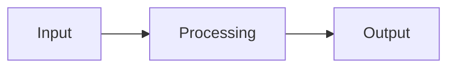

# Chapter: [Title]

> Status: Draft / Complete
>
> Course chapter: [number and title]

## Learning Goals

- [Goal]
- [Goal]
- [Goal]

## Why This Matters

Explain the problem this technique solves and where it fits in a RAG search system.

## Key Concepts

| Term | Meaning |
| --- | --- |
| [Term] | [Definition] |

## Theory and Formulas

Describe the core model, assumptions, and formulas. Use KaTeX-compatible Markdown for mathematics.

## Repository Implementation

Describe the modules, functions, data structures, and commands that implement this chapter in this project. Distinguish implemented behavior from planned behavior.

## Data Flow



## Worked Example

Show a small input, the intermediate representation, and the result.

```python
# Keep examples runnable from the repository root when possible.
```

## Dos and Don'ts

### Do

- [Practice]

### Don't

- [Pitfall]

## Failure Modes and Edge Cases

- [Edge case]
- [Failure mode]

## Verification

```bash
# Add a project command or focused check.
```

## References

- [Reference title](https://example.com)

## Further Reading

- [Reading title](https://example.com)
